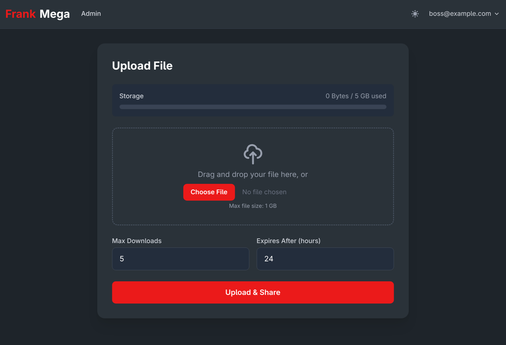

# FrankMega

Self-hosted, security-hardened file sharing service designed for sharing files with family and friends. Upload a file, get a time-limited download link with a counter, share it. Files auto-expire after a configurable TTL (max 24h) or when the download limit is reached.

Not intended for public-facing or large-scale deployments — the primary use case is a personal home server behind a Cloudflare Tunnel, where you control who gets an account via invite-only registration.

Built with Ruby on Rails 8.1, SQLite3, Tailwind CSS. Zero external services required — no Redis, no Postgres, no S3.



## Features

- **Time-limited sharing** — configurable TTL (1–24h) and download counter (1–100)
- **Two-step downloads** — public landing page shows file info before consuming a download
- **Invite-only registration** — first user becomes admin, everyone else needs an invitation code
- **Passkey / WebAuthn support** — passwordless login via hardware keys or platform authenticators
- **TOTP 2FA** — optional authenticator app verification with QR code setup
- **Admin panel** — manage users, invitations, files, and allowed MIME types
- **Upload validation** — client-side file size, quota, and filename checks before upload; server-side filename sanitization strips traversal paths, control characters, and Windows reserved names
- **Aggressive rate limiting** — Rack::Attack throttles + automatic IP banning on suspicious behavior
- **Cloudflare-aware** — trusts Cloudflare proxy IPs so `request.ip` returns the real client
- **Dark mode** — toggle with system preference fallback
- **QR codes** — generated for every download link
- **Real-time notifications** — Turbo Streams notify uploaders when their files are downloaded
- **Auto-cleanup** — background jobs purge expired files and bans every 15 minutes

## Production Deployment (Docker Compose + Cloudflare Tunnel)

The recommended setup runs FrankMega behind a [Cloudflare Tunnel](https://developers.cloudflare.com/cloudflare-one/connections/connect-networks/) — no open ports, no self-managed TLS certificates, free DDoS protection. The included `docker-compose.yml` runs both the app and the `cloudflared` connector as a sidecar.

### 1. Create a Cloudflare Tunnel

1. In the [Cloudflare Zero Trust dashboard](https://one.dash.cloudflare.com/), go to **Networks > Tunnels** and create a new tunnel
2. Choose **Cloudflared** as the connector type
3. Copy the **tunnel token** (you'll need it for the `.env` file)
4. Add a public hostname rule:
   - **Subdomain:** `frankmega` (or your choice)
   - **Domain:** `yourdomain.com`
   - **Service:** `http://web:80` (this is the Docker internal hostname)
5. Under your domain's **SSL/TLS** settings, set encryption mode to **Full**

### 2. Generate secrets

```bash
# Secret key base
docker run --rm ruby:3.4.8-slim ruby -e "puts SecureRandom.hex(64)"

# ActiveRecord encryption keys (generates 3 keys, one per line)
docker run --rm ruby:3.4.8-slim ruby -e "3.times { puts SecureRandom.hex(32) }"
```

### 3. Create a `.env` file

> **Important:** `RAILS_MASTER_KEY` must be the exact value from `config/master.key` in the repo (32 hex characters). Do **not** generate a new one — it must match the key that encrypted `config/credentials.yml.enc`. All other variables below are also required.

```env
SECRET_KEY_BASE=<generated above>
RAILS_MASTER_KEY=<copy exact contents of config/master.key>

# Must match the domain configured in the Cloudflare Tunnel
HOST=frankmega.yourdomain.com
WEBAUTHN_ORIGIN=https://frankmega.yourdomain.com
WEBAUTHN_RP_ID=frankmega.yourdomain.com

ACTIVE_RECORD_ENCRYPTION_PRIMARY_KEY=<first key>
ACTIVE_RECORD_ENCRYPTION_DETERMINISTIC_KEY=<second key>
ACTIVE_RECORD_ENCRYPTION_KEY_DERIVATION_SALT=<third key>

# Cloudflare Tunnel token (from Zero Trust dashboard)
TUNNEL_TOKEN=<your tunnel token>

# SMTP (optional — omit or leave blank to disable email delivery)
SMTP_ADDRESS=smtp.gmail.com
SMTP_PORT=587
SMTP_USERNAME=you@gmail.com
SMTP_PASSWORD=your-app-password
```

> **WebAuthn:** The `HOST`, `WEBAUTHN_ORIGIN`, and `WEBAUTHN_RP_ID` must match the domain in your Cloudflare Tunnel. Passkey registration/authentication will fail silently if these don't match.

### 4. Start the stack

```bash
docker compose up -d
```

Or build from source instead of pulling from Docker Hub:

```bash
docker compose build
docker compose up -d
```

The pre-built image is available at [`akitaonrails/frankmega`](https://hub.docker.com/r/akitaonrails/frankmega) on Docker Hub.

On first visit to `https://frankmega.yourdomain.com`, you'll be prompted to create the admin account.

Data is persisted in two Docker volumes: `uploads` (files) and `db_data` (SQLite databases).

The app automatically trusts [Cloudflare IP ranges](https://www.cloudflare.com/ips/) so that rate limiting and IP banning work against real client IPs, not Cloudflare's.

> **Local testing without Cloudflare:** The web container also exposes port 3100 for direct access (`http://localhost:3100`). Set `FORCE_SSL=false` in your `.env` if testing locally without TLS.

## Local Development

### Prerequisites

- Ruby 3.4.8 (use [mise](https://mise.jdx.dev/), rbenv, or asdf)
- Bundler

### Setup

```bash
bundle install
rails db:prepare
rails db:seed        # seeds default allowed MIME types
bin/dev              # starts Rails server + Tailwind watcher on port 3000
```

`bin/dev` uses foreman to run both the Rails server and the Tailwind CSS watcher.

### Security settings in development

Rate limits are 10x more lenient and IP banning is disabled by default. See `config/initializers/security.rb` to adjust:

| Setting                     | Production | Development |
|-----------------------------|------------|-------------|
| Rate limit multiplier       | 1x         | 10x         |
| Ban duration                | 1 hour     | 1 minute    |
| IP banning enabled          | yes        | no          |
| Invalid hash attempts limit | 3          | 10          |
| Minimum password length     | 12 chars   | 12 chars    |

## Running Tests

```bash
bundle exec rails test                 # full test suite
bundle exec rails test test/models     # model tests only
bundle exec rails test test/controllers/downloads_controller_test.rb  # single file
```

### Linters and security checks

```bash
bundle exec rubocop                    # style (rubocop-rails-omakase)
bundle exec brakeman --no-pager        # static security analysis
bundle exec bundler-audit check        # vulnerable gem detection
```

All four checks run automatically via [Lefthook](https://github.com/evilmartians/lefthook) git hooks — rubocop, brakeman, and bundler-audit on pre-commit, full test suite on pre-push.

## License

MIT
